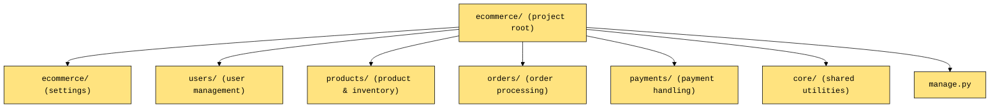

# Django E-commerce Backend (DRF-based)

#### project structure (summarized):

## Command for starting development

#### Create a virtual environment
`python -m venv .venv`

#### Activate the virtualenv
- windows `.venv\Scripts\activate`
- mac [or] linux `source .venv\Scripts\activate`

#### Install the packages
`pip install -r requirements.txt`

`cd ecommerce`

#### Make db migrations and migrate
   - `python manage.py makemigrations`
   - `python manage.py migrate`

#### Run the app in 8000
`python manage.py runserver 8000`